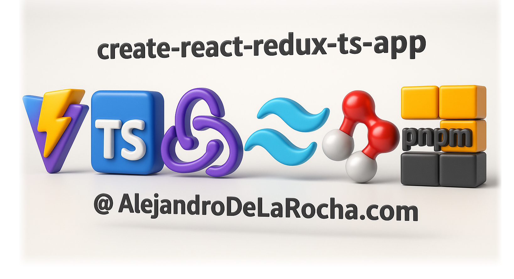

<p align="center" style="background: white">
  
</p>

<h1 align="center">new-react-redux-ts-app</h1>

A React + Redux Toolkit + Saga template for modern Frontend projects, powered with TypeScript and styled using SCSS and Tailwind.

---

## 🚀 Getting Started

### 1. Install `Node 22.15.0` (LTS - Long Term Support)

It's recommended to use Node Version Manager instead of installing Node directly into your computer.
With NVM you can switch between Node versions and use them as needed.

For Windows, download the [`nvm-setup.exe`](https://github.com/coreybutler/nvm-windows/releases/tag/1.2.2)

For MacOS we recomend using Homebrew, so run the following for installing Homebrew

```bash
/bin/bash -c "$(curl -fsSL <https://raw.githubusercontent.com/Homebrew/install/master/install.sh>)"
```
Then install NVM
```bash
brew install nvm
```

For enabling our bash terminal to use NVM you need to modify the profile.

```bash
source $(brew --prefix nvm)/nvm.sh
```

Now you can install Node using NVM.

```bash
nvm install 22.15.0
nvm use 22.15.0
```

### 2. Install `pnpm`

We use [`pnpm`](https://pnpm.io/) for faster and more efficient package management pnpm; is the fastest package manager for node ([`source`](https://www.cookielab.io/blog/package-managers-comparison-yarn-npm-pnpm#:~:text=PNPM%20is%20the%20newest%20and%20fastest%20package%20manager.,that%20it%20also%20uses%20symlinks.))
/
If you don't have it installed:

```bash
npm install -g pnpm
```

### 3. Install dependencies

For installing the dependencies you should run

```zsh
pnpm install
```
(Make sure you are inside the app directory)

Running the app locally

```bash
pnpm dev
```
You should see the Default **Home** component.


In order to use the API Call you need to create an ENV file in your root folder.

><span style="color:green; background: black; font-weight: bold"> .env.development </span>  &nbsp;&nbsp;file content
```env
# PLACEHOLDER API URL
VITE_API_URL=https://jsonplaceholder.typicode.com/
```

## 🧪 Running tests
```bash
pnpm test
```
```bash
pnpm test --coverage
```
All the test should be located inside **src/** folder and have **.test.** in the extension name.

## 📁 Project Structure
```bash
src/
├── App.module.scss
├── App.tsx
├── index.css
├── main.tsx
├── setupTests.ts
├── vite-env.d.ts
├── __mocks__/
│   └── fileMock.js
├── assets/
│   └── img/
│       create-react-redux-ts-app-logo.png
├── design-system-ui/ # Button, Input, Dropdown, Checkbox, according to your Branding.
├── components/ # Components that would be implemented in views/ folder
├── hooks/ # Custom hooks
├── routes/ # Routes (Normally Components from views folder)
│   └── index.tsx
├── store/
│   ├── api.tsx # API Config including auth
│   ├── hooks.tsx # Store hooks useAppDispatch/useAppSelector
│   ├── index.ts
│   ├── selectors.ts # All selectors from redux store
│   ├── services/ # API Calls for respective slices
│   │   └── Users.tsx # API Calls for Users
│   ├── slices/ # Each slice has 4 files for the redux store
│   │   ├── counter/
│   │   │   ├── actions.tsx
│   │   │   ├── reducers.tsx
│   │   │   ├── sagas.tsx
│   │   │   └── types.tsx
│   │   └── users/
│   │       ├── actions.tsx
│   │       ├── reducers.tsx
│   │       ├── sagas.tsx
│   │       └── types.tsx
├── styles/
│   └── colors.scss # Color palette for your Branding
├── types/ # All custom types
│   ├── counter.d.ts
│   ├── index.tsx
│   ├── types.d.ts
│   └── users.d.ts
├── utils/ # Formatters, stateless functions, ex: formatDate.tsx
├── views/ # Views that would be integrated into the router
│   ├── Home.test.tsx # Unit testing always in the same folder as the Component/Function
│   └── Home.tsx
```
## 💻 Tech Stack
- Node `22.15.0`
- pnpm `10.10.0`
- Vite `6.3.5` + TypeScript `5.8.3`
- Tailwind CSS `4.1.6`
- Redux (Redux Toolkit `2.8.1`)
- Sass `1.87.0`
- Jest `29.7.0`
- React Router `7.6.0`
- Redux Saga `1.3.0`
- Axios `1.9.0`

## 📄 License

MIT License

Copyright (c) (2025) [Alejandro De La Rocha](https://AlejandroDeLaRocha.com/)

Permission is hereby granted, free of charge, to any person obtaining a copy